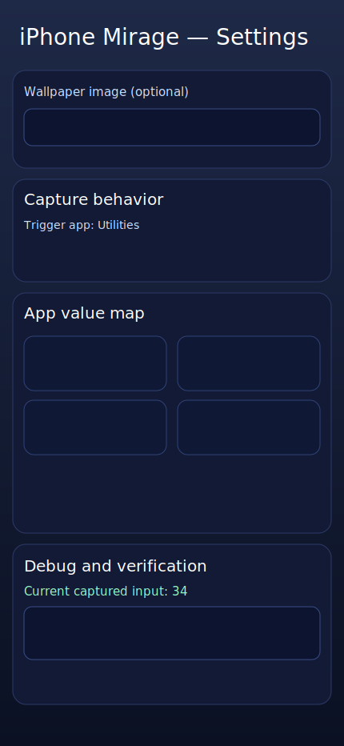
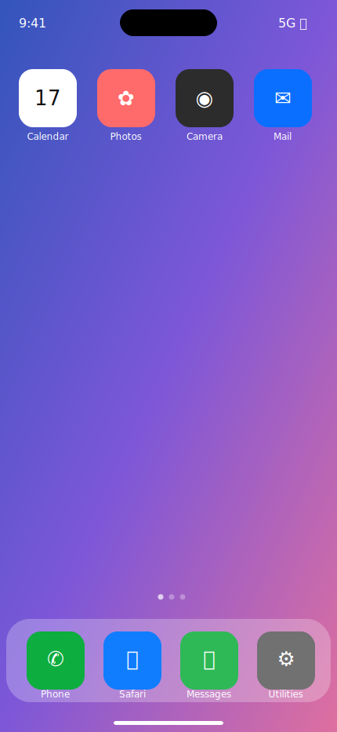

# iPhone Mirage Trick

This trick simulates an iPhone-style home screen with hidden settings access.

## Preview

### Settings

### Perform Mode

## Hidden settings gesture
1. Long-press the **Clock** icon for at least 1 second.
2. Tap the top-left corner 3 times quickly.

## Trick flow
1. In **Settings**, assign a value to any app icon.
2. Pick a trigger app (the app that ends input and copies the result).
3. In **Perform**, tap app icons to build a string (e.g. `3` then `4` → `34`).
4. Tap the trigger app to copy the full result to clipboard.
5. Paste into the clipboard verification field in Settings to confirm.

> Note: These are lightweight static previews checked into the repo so links never break in PR/comment contexts.
